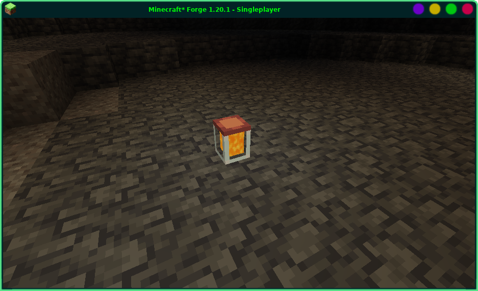

# TinyJar

A jar with Molten Slag (liquid from Create metallurgy modification).

## Dependencies
Create [6.0.8 to 6.0.10]

## Information

A jar is crafted with one Copper Sheet over one Glass block and stores up to 90mb of any liquid, keeping it upon being broken.
Can be filled with Spout and emptied with Item Drain from Create. Also can be filled/emptied with Pipes connected to it.

## Final words

I do not even feel like taking credit for it. It was made with extensive explanations of Claude Sonnet. I was mostly defining the ideas and adjusting things when they went wrong.

I am not fond of letting artificial intelligence write code for me. Still, modifying Minecraft is confusing and I do not want to read this scattered documentation.

Moreover, this was made more for entertainment rather than for proper study.